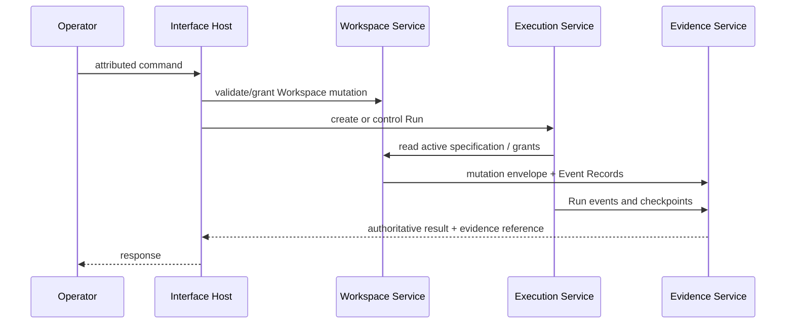
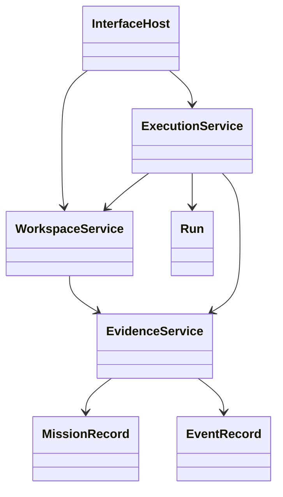

# Architecture

OperatorOS is a local-first, operator-controlled, event-evidenced Mission execution platform. Four replaceable implementation components share one Domain contract while Workspace artifacts and sealed Mission Records remain authoritative. The frozen authority is [`docs/authorities/architecture.md`](authorities/architecture.md).

## Four components

| Component             | Responsibility                                                                                                    |
| --------------------- | ----------------------------------------------------------------------------------------------------------------- |
| **Workspace Service** | Validates and commits Workspace-scoped mutations and rebuilds projections.                                        |
| **Execution Service** | Executes Mission specifications as recoverable Runs and coordinates adapters.                                     |
| **Evidence Service**  | Appends immutable Event Records, indexes/seals Mission Records, verifies integrity, and reconstructs projections. |
| **Interface Host**    | Attributes requests and exposes the shared command/query contract to the CLI and in-process dispatcher.           |

## Component sequence



## Component relationships



## Authority chain

Human/operator authority is upstream. Workspace OS semantics and the frozen v0.8 release line are respected; the Platform does not rewrite them. Workspace Service owns Workspace-scoped command coordination, Execution Service owns Runs, Evidence Service owns Event Records and Mission Record evidence, and Interface Host owns attribution/transport. Projections are rebuildable and never authorize commands. The architecture SHA-256 is `1e79049d9ae5a328556378ff8235525cd0f692bfa317fd7da6dc2bcdb1f27610`.

## Local and Hosted profiles

**Local** is canonical by default: no required network authority or telemetry, isolated Workspace stores, and SQLite WAL evidence persistence. `hosted-runtime` implements an in-memory multi-tenant contract shape, not a production hosted deployment. Future hosted adapters must preserve the same contracts and authority rules while supplying durable storage, identity, network, and operational controls. HTTP API, SDK, dashboard, and telemetry applications are not bundled in v1.0.

## Recovery model

Acknowledged mutations are durable only when authoritative records, required events, and idempotency results are mutually referenced. Recovery Service uses leases and fencing tokens to preempt zombie contenders; when two contenders remain, the lexicographically smaller contender wins. Checkpoints and snapshots support reconstruction without trusting process memory.

## Evidence ledger and mutation envelopes

Event Records are immutable, correlated, digest-bearing, and secret-free. Evidence Service owns the implementation-level envelope:

```text
prepared -> committing -> committed -> acknowledged
    |           |             |
    +-> aborted +-> unresolved +-> acknowledged-on-retry
```

A crash is reconciled from durable evidence. Retry `committed` mutations with the same request key; never synthesize missing evidence or bypass idempotency with a new key.
