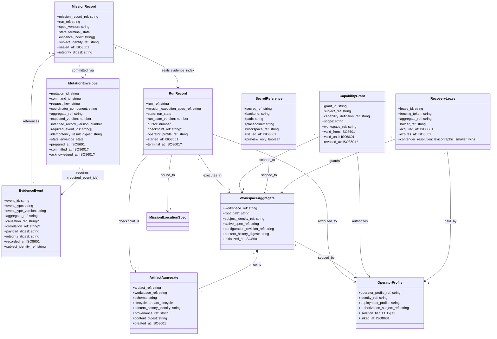

# Core evidence and workflow entities

This is the canonical evidence and workflow entity model. It captures the ten
records that the Evidence Service, Workspace Service, and Execution Service
coordinate around: the durable Mission Record, the active Run, the immutable
Event Record, the Mutation Envelope, the two Workspace aggregates, the
operator-attribution record, the Capability Grant, the Secret Reference, and
the Recovery Lease.

## Reading notes

- **MissionRecord** is the authoritative evidence index for one Run. It is
  sealed at terminal state and references every EvidenceEvent by digest.
- **RunRecord** is the active state machine; it is the only owner of Run
  transitions and exposes optimistic concurrency via `run_state_version`.
- **EvidenceEvent** is immutable, secret-free, and digest-bearing. The
  `payload_digest` + `integrity_digest` pair supports tamper detection.
- **MutationEnvelope** is the implementation-level acknowledgement protocol.
  It is not a Domain entity and owns no business truth; it makes command
  acknowledgement and reconciliation deterministic.
- **WorkspaceAggregate** is the operator-controlled scope owning Artifacts and
  the active Mission Execution Specification.
- **ArtifactAggregate** is the durable content record; it has both provenance
  and content-history identity.
- **OperatorProfile** links one Workspace OS Identity to Platform-local
  preferences and authorization subjects.
- **CapabilityGrant** is a time- and scope-bounded authorization for one
  subject to use one Capability Definition.
- **SecretReference** is a typed pointer to an externally owned secret value;
  the value itself never lives in the Platform.
- **RecoveryLease** is the fencing primitive that prevents zombie contenders
  from double-committing state during recovery.
