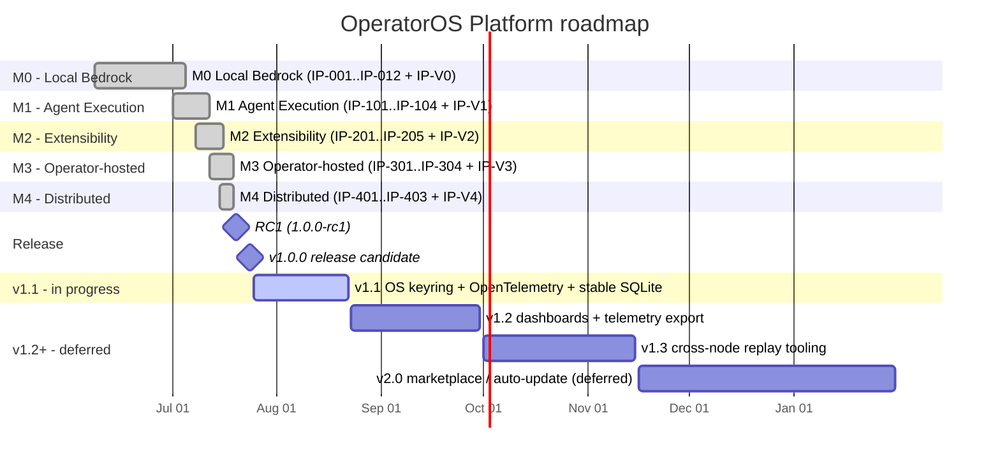

# Roadmap

The repository implements the M0..M4 v1.0 scope. Public v1.0 publication and tagging remain pending; v1.1 is the next planned slice focused on technical debt; v1.2 and beyond are deferred and will be re-scoped against the v1.1 outcome.

## Repository scope

The v1.0 repository includes the executable CLI, in-process interface dispatcher, four authoritative services, extension and hosted-runtime contract shapes, and distributed coordination primitives. HTTP API, SDK packaging, dashboard, and telemetry deployment are future integration work, not bundled v1.0 applications.

## Visual timeline

## Milestone ledger

| Milestone | Title             | Status   | Window                  | Implemented repository scope                                                                |
| --------- | ----------------- | -------- | ----------------------- | ------------------------------------------------------------------------------------------- |
| M0        | Local Bedrock     | Closed   | 2026-06-08 → 2026-07-05 | Offline Workspace / Mission / Run core with evidence, security, recovery, CLI, v0.8 import  |
| M1        | Agent Execution   | Closed   | 2026-07-01 → 2026-07-12 | Agent registry, capability matching, and invocation flow                                    |
| M2        | Extensibility     | Closed   | 2026-07-08 → 2026-07-16 | Extension manifests, lifecycle, capability checks, and compatibility contracts              |
| M3        | Operator-hosted   | Closed   | 2026-07-12 → 2026-07-19 | Hosted-runtime tenant-store and isolation contract shape; no bundled dashboard              |
| M4        | Distributed       | Closed   | 2026-07-15 → 2026-07-19 | Peer registry, checkpoint anchoring, reconciliation, and recovery boundaries                |
| RC1       | 1.0.0-rc1         | Closed   | 2026-07-20              | First Release Candidate; gates E, G, H, K passing                                           |
| v1.0.0    | Release candidate | Ready    | 2026-07-24              | Working-tree release candidate; public repository, commit, tag, and release remain pending. |
| v1.1      | Hardening         | Planned  | 2026-07-25 → 2026-08-22 | OS keyring, OpenTelemetry, stable SQLite binding, tracked technical-debt work               |
| v1.2      | Observability     | Deferred | 2026-08-23 → 2026-09-30 | Dashboards, telemetry export, projection rebuild tooling                                    |
| v1.3      | Cross-node replay | Deferred | 2026-10-01 → 2026-11-15 | Cross-node replay tooling, evidence inspection CLI improvements                             |
| v2.0      | Marketplace       | Deferred | 2026-11-16 → 2027-01-31 | Marketplace / auto-update (explicitly NOT implied by M2; deferred until a security review)  |

## Re-scoping rules

1. M0..M4 are additive release slices; each closes its own gate and keeps prior
   gates green.
2. Local is canonical. M0..M2 require no network for authoritative Workspace
   behaviour.
3. M3 and M4 are optional profiles and cannot block Local releases.
4. v1.1 is the next active slice; v1.2+ are deferred pending the v1.1 outcome.
5. No marketplace or auto-update surface is implied by M2 — that is a v2.0
   concern gated on a future security review.
