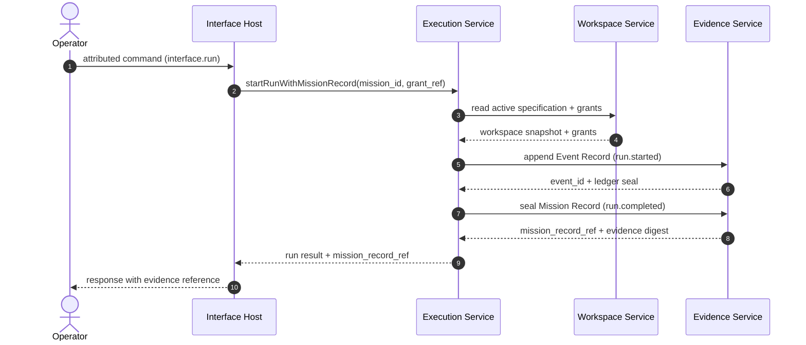

# Mission run — sequence diagram

This diagram shows a single attributed Mission run end-to-end across the four
authoritative components. The Operator initiates the action through the v1.0
Interface Host surface (CLI/in-process dispatcher). The Interface Host attributes the
request and dispatches it. The Execution Service then opens a Run, the Evidence
Service seals the resulting Mission Record, and the operator receives a
response that points back to the durable evidence.

## Walk-through

1. **Operator → Interface Host.** The operator issues an attributed command
   through the CLI or in-process dispatcher. The Interface Host is the only place
   where attribution and transport are enforced.
2. **Interface Host → Execution Service.** The dispatcher calls
   `startRunWithMissionRecord` with the mission identifier and the active
   Capability Grant reference.
3. **Execution Service → Workspace Service.** The Execution Service reads the
   active Mission Execution Specification and the scoped grants from the
   Workspace Service.
4. **Execution Service → Evidence Service.** A `run.started` Event Record is
   appended to the evidence ledger. The ledger returns an event identifier and
   seals the head.
5. **Execution Service → Evidence Service (terminal).** When the Run reaches a
   terminal state, the Mission Record is sealed and the ledger returns a
   durable reference plus an integrity digest.
6. **Execution Service → Interface Host → Operator.** The response carries
   both the run result and the `mission_record_ref`, so the operator can point
   back to the durable evidence for any post-hoc audit.
